# Aurens HR Platform ER図 Ver1.3

GitHub上で表示できるように Mermaid 形式で記載する。

```mermaid
erDiagram
    companies ||--o{ offices : has
    companies ||--o{ departments : has
    companies ||--o{ positions : has
    companies ||--o{ employment_types : has

    departments ||--o{ employees : belongs_to
    positions ||--o{ employees : belongs_to
    employment_types ||--o{ employees : belongs_to

    employees ||--|| employee_profiles : has
    employees ||--o{ employee_addresses : has
    employees ||--o{ employee_contracts : has
    employees ||--o{ employee_families : has
    employees ||--o{ employee_bank_accounts : has
    employees ||--o{ employee_social_insurances : has
    employees ||--o{ employee_employment_insurances : has
    employees ||--o{ employee_qualifications : has
    employees ||--o{ employee_custom_values : has

    employee_custom_fields ||--o{ employee_custom_values : defines

    employees ||--o{ onboarding_cases : created_from
    onboarding_cases ||--o{ onboarding_tasks : has
    onboarding_cases ||--o{ onboarding_documents : has

    employees ||--o{ employee_requests : submits
    employee_requests ||--o{ employee_request_items : has
    employee_requests ||--o{ approval_logs : has

    approval_routes ||--o{ approval_steps : has
    approval_steps ||--o{ approval_logs : records

    employees ||--o{ salary_statements : has
    salary_statements ||--o{ salary_statement_items : has
    salary_import_batches ||--o{ salary_statements : creates
    salary_publish_settings ||--o{ salary_statements : controls

    employees ||--o{ mynumber_statuses : has
    employee_families ||--o{ mynumber_statuses : has

    employees ||--o{ egov_applications : target
    egov_applications ||--o{ egov_application_documents : has
    egov_applications ||--o{ egov_status_logs : has

    users ||--o{ user_roles : has
    roles ||--o{ user_roles : assigned
    roles ||--o{ role_permissions : has
    permissions ||--o{ role_permissions : defines

    users ||--o{ notifications : receives
    users ||--o{ audit_logs : operates
    employees ||--o{ audit_logs : target

    files ||--o{ onboarding_documents : attached
    files ||--o{ employee_qualifications : attached
    files ||--o{ employee_requests : attached
```

## 補足

- `employees` は勤怠システムの職員IDを保持する参照テーブル。
- 勤怠システム側のマスターを正とし、Aurens HR側は人事労務追加情報を保持する。
- マイナンバーは初期版では番号を保持せず、`mynumber_statuses` で提出状況のみ管理する。
- e-Govは最終的に送信・結果取得・公文書取得まで対応する。
