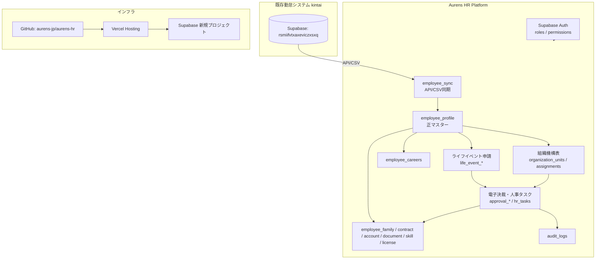

# Aurens HR Platform 全体アーキテクチャ概要 Ver1.0

対象: Ver1.4(開発標準) + Ver1.5(組織機構表・ライフイベント・電子決裁) を統合し、実装ブロッカー解消後の設計を反映したもの。

## 1. 全体アーキテクチャ図



技術スタック: Next.js(App Router) + TypeScript + Tailwind CSS + shadcn/ui + Supabase(PostgreSQL / Auth / Storage) + Supabase Client(Prismaは不採用) + Vercelホスティング。

既存勤怠(kintai)とはSupabaseプロジェクトを分離し、`employee_sync` を介したAPI/CSV連携のみで接続する。クロスプロジェクトの直接DB参照は行わない。

## 2. ディレクトリ構成(確定版)

```
aurens-hr/
├─ app/
├─ components/
├─ features/
│  ├─ employee/
│  ├─ organization/
│  ├─ career/
│  ├─ lifeevent/
│  ├─ workflow/        # 電子決裁・人事タスク自動生成
│  ├─ onboarding/
│  ├─ notification/
│  ├─ salary/
│  ├─ egov/
│  ├─ master/
│  ├─ setting/
│  └─ audit/
├─ modules/
│  ├─ hr/               # 本リポジトリの実体
│  ├─ attendance/        # 将来: kintai統合用プレースホルダ
│  ├─ payroll/           # 将来
│  ├─ ai/                # 将来
│  └─ common/
├─ lib/ / hooks/ / types/ / services/ / supabase/
├─ docs/
│  ├─ 00_project/ 01_architecture/ 02_business/ 03_database/
│  └─ 04_api/ 05_screen/ 06_development/ 07_release/
├─ database/
│  ├─ tables/ views/ functions/ policies/ seed/
├─ screens/
│  ├─ employee/ organization/ career/ lifeevent/ workflow/ salary/ egov/ setting/ dashboard/
├─ api/
│  ├─ employee/ organization/ career/ lifeevent/ workflow/ salary/ egov/ master/
├─ claude/
│  ├─ architecture/{system.md, database.md}
│  ├─ rules/{coding.md, ui.md, git.md}
│  └─ prompts/{issue.md, screen.md, api.md}
├─ prompts/ / scripts/ / tests/ / public/
└─ .github/
   ├─ ISSUE_TEMPLATE/issue.md
   └─ PULL_REQUEST_TEMPLATE.md
```

前回案からの変更点: `features/` `screens/` `api/` に `career` `lifeevent` `workflow`(決裁・タスクを内包)を追加し、Ver1.5機能のドメインを明示的に位置づけた(レビュー指摘E-15の解消)。

## 3. モジュール一覧

| モジュール | 内容 | 現状 |
|---|---|---|
| hr | 人事労務(本リポジトリの実体。Ver1.4+Ver1.5の全機能) | 開発対象 |
| attendance | 既存勤怠(kintai)。Aurens HR側からは employee_sync 経由でのみ接続 | 別リポジトリ、触らない |
| payroll | 給与計算・年末調整 | 将来(開発標準Phase8相当) |
| ai | AI機能 | 将来(開発標準Phase9相当) |
| common | 全モジュール共通のUI・認証・権限基盤 | hr開発と並行整備 |

## 4. DB一覧

### 認証・権限(MVP)
| テーブル | 内容 |
|---|---|
| roles | 9ロール定義 |
| permissions | 権限コード定義 |
| role_permissions | ロール×権限 |
| user_roles | ユーザー×ロール |

### 従業員
| テーブル | 内容 | スコープ |
|---|---|---|
| employee_sync | 勤怠マスター仮同期 | MVP |
| employee_profile | HR正マスター | MVP |
| employee_family | 家族情報 | 将来 |
| employee_contract | 雇用契約情報 | 将来 |
| employee_account | 振込口座情報 | 将来 |
| employee_document | 提出書類状況(マイナンバー含む) | 将来 |
| employee_skill | スキル情報 | 将来 |
| employee_license | 資格・免許 | 将来 |

### 組織(Ver1.5)
| テーブル | 内容 | 備考 |
|---|---|---|
| organization_fiscal_years | 年度別機構表 | |
| organization_units | 部署 | |
| organization_unit_types | 部署種別マスタ | 新規・要作成(不足設計) |
| positions | 役職マスタ | 新規・要作成(不足設計) |
| organization_assignments | 職員所属 | |

### 経歴(Ver1.5)
| employee_careers | 異動・役職・兼務・出向履歴 |

### ライフイベント(Ver1.5)
| テーブル | 内容 | 備考 |
|---|---|---|
| life_event_types | イベント種別 | |
| life_event_questions | Yes/No質問 | |
| life_event_rules | 回答→アクション定義 | |
| life_event_applications | 申請 | |
| life_event_answers | 回答 | |
| life_event_master_update_queue | マスター反映キュー | 新規・ブロッカーA-6対応 |

### 決裁・タスク(Ver1.5)
| テーブル | 内容 | 備考 |
|---|---|---|
| approval_route_templates | 決裁ルートテンプレート | 新規・ブロッカーB-8対応 |
| approval_route_template_steps | テンプレートステップ | 新規 |
| approval_requests | 決裁申請 | |
| approval_steps | 決裁ステップ実績 | 先着承認方式に変更 |
| approval_step_candidates | 承認候補者 | 新規・先着承認方式用 |
| hr_tasks | 人事タスク | |

### 監査(MVP)
| audit_logs | 操作ログ |

全テーブルに共通カラム(id, uuid, created_at, updated_at, deleted_at, created_by, updated_by)を適用する。現行Ver1.5定義は未適用(不足している設計を参照)。

## 5. API一覧

### 従業員・同期
API-EMP-001 従業員一覧取得 / API-EMP-002 従業員詳細取得・更新 / API-SYNC-001 CSV取込・同期実行

### 組織
API-ORG-001〜007(組織一覧取得/詳細取得/作成/更新/ドラッグ&ドロップ移動/職員配置更新/集計取得)

### 経歴
API-CAREER-001 経歴一覧取得 / API-CAREER-002 経歴登録

### ライフイベント
API-LIFE-001 定義取得 / API-LIFE-002 Yes/No回答保存 / API-LIFE-003 申請・タスク自動生成

### 決裁
API-APPROVAL-001 申請 / API-APPROVAL-002 承認 / API-APPROVAL-003 差戻し

### タスク
API-TASK-001 一覧取得 / API-TASK-002 完了

### 監査
API-LOG-001 操作ログ記録(内部共通処理)

詳細なリクエスト/レスポンス例はStep4(API設計)で作成する。

## 6. 画面一覧

**MVP**: HR-AUTH-001(ログイン) / HR-DASH-001(ダッシュボード) / HR-EMP-001(従業員一覧) / HR-EMP-002(従業員詳細)

**Ver1.5**: HR-ORG-001〜007 / HR-CAREER-001〜002 / HR-LIFE-001〜004 / HR-APPROVAL-001〜002 / HR-TASK-001〜002

- 詳細設計済み(7画面): HR-ORG-001〜003, HR-LIFE-001〜002, HR-APPROVAL-001, HR-TASK-001
- 詳細設計未着手(10画面): HR-ORG-004〜007, HR-CAREER-001〜002, HR-LIFE-003〜004, HR-APPROVAL-002, HR-TASK-002(不足している設計を参照)
